# EVAPA AWS Infrastructure

<p align="center">
  <strong>Enterprise Vulnerability Assessment and Patching Automation on AWS</strong>
</p>

<p align="center">
  
  
  
  
  
  
  
  
  
  
</p>

## Overview

EVAPA is a cloud security capstone project that builds an AWS-based vulnerability management lab with Terraform. The repository provisions vulnerable Linux and Windows EC2 targets, an OpenVAS scanner, serverless APIs for scan orchestration, S3 report storage, a Lambda parser, DynamoDB findings storage, and Ansible/SSM automation artifacts.

The project demonstrates an end-to-end security operations workflow:

1. Build cloud infrastructure from version-controlled Terraform.
2. Deploy intentionally vulnerable Linux and Windows workloads for controlled testing.
3. Scan the targets with OpenVAS/Greenbone.
4. Export OpenVAS XML reports to S3.
5. Parse high-severity findings into DynamoDB.
6. Query findings through API Gateway and Lambda.
7. Use Ansible over AWS Systems Manager for patching and remediation exercises.

> [!IMPORTANT]
> This repository intentionally creates vulnerable systems for education and demonstration. Deploy it only in an isolated lab account or sandbox VPC. Do not use these target configurations in production.

## Why This Project Exists

Enterprise vulnerability management often fails when scanning, prioritization, patching, and evidence collection are handled as separate manual tasks. EVAPA shows how those steps can be connected with Infrastructure as Code and cloud-native automation so a security team can move from asset deployment to scan evidence and remediation more consistently.

The project is designed to answer practical questions:

| Question | Repository answer |
|---|---|
| How can a repeatable lab be deployed for vulnerability assessment? | Terraform provisions EC2, IAM, S3, DynamoDB, Lambda, API Gateway, security groups, and backend state. |
| How can scan reports become queryable data? | OpenVAS XML reports are uploaded to S3, parsed by Lambda, and stored in DynamoDB. |
| How can scan control be exposed programmatically? | API Gateway routes invoke Python Lambdas that call OpenVAS GMP over port 9390. |
| How can patching be practiced safely? | Ansible playbooks and SSM inventory support Linux and Windows remediation workflows in a lab. |

## Key Features

- Two-stage Terraform architecture with a one-time backend bootstrap and a main infrastructure stack.
- Remote Terraform state stored in S3 with DynamoDB state locking.
- Ubuntu and Windows Server EC2 targets configured for vulnerability assessment exercises.
- Dedicated OpenVAS scanner EC2 host running the Greenbone Community Edition Docker stack.
- REST API for OpenVAS actions: create/list port lists, create/list targets, create/list tasks, and start scans.
- S3 event pipeline that parses OpenVAS XML reports and stores high-severity findings in DynamoDB.
- HTTP API endpoint for reading stored findings.
- IAM roles for EC2 SSM management, Lambda execution, DynamoDB access, and S3 report upload.
- CloudWatch log groups for parser and findings-query Lambdas.
- Ansible playbooks and SSM inventory for patching and remediation practice.
- AWS console screenshots documenting the project build-out.

## Technology Stack

| Layer | Technologies |
|---|---|
| Infrastructure as Code | Terraform >= 1.5, HashiCorp AWS provider ~> 5.0 |
| Cloud platform | AWS us-east-1 |
| Compute | Amazon EC2, Ubuntu 20.04, Ubuntu 22.04, Windows Server 2019 |
| Vulnerability scanning | OpenVAS / Greenbone Community Edition, python-gvm |
| Serverless | AWS Lambda with Python 3.12, Python 3.11, and Node.js 20.x |
| API layer | API Gateway REST API for OpenVAS control, API Gateway HTTP API for findings |
| Storage | Amazon S3 for Terraform state and OpenVAS reports |
| Database | DynamoDB for Terraform locks and parsed scan findings |
| Operations | AWS Systems Manager, Ansible, CloudWatch Logs |
| Scripts | Bash, PowerShell, Python |

## Repository Structure

```text
.
|-- README.md
|-- docs/
|   |-- diagrams/
|   `-- screenshots/
|-- terraform-bootstrap/
|   |-- main.tf
|   `-- README.md
`-- terraform-infra/
    |-- backend.tf
    |-- provider.tf
    |-- versions.tf
    |-- variables.tf
    |-- ec2.tf
    |-- sg.tf
    |-- iam.tf
    |-- s3.tf
    |-- dynamodb.tf
    |-- lambda_api.tf
    |-- lambda_parser.tf
    |-- openvas_lambda.tf
    |-- openvas_api.tf
    |-- apigateway.tf
    |-- cloudwatch.tf
    |-- ansible_hosts.tf
    |-- outputs.tf
    |-- README.md
    |-- lambda/
    |-- packages/
    |-- playbooks/
    `-- scripts/
```

| Path | Purpose |
|---|---|
| `terraform-bootstrap/` | One-time stack that creates the S3 remote state bucket and DynamoDB lock table used by the main Terraform stack. |
| `terraform-infra/` | Main AWS infrastructure stack for the vulnerability lab, scanner, APIs, storage, IAM, and automation assets. |
| `terraform-infra/lambda/` | Lambda source files and deployment zip artifacts for OpenVAS control, report parsing, and findings reads. |
| `terraform-infra/packages/` | Prebuilt Lambda layer artifact used by the OpenVAS control Lambdas. |
| `terraform-infra/playbooks/` | Ansible playbooks and SSM inventory for lab setup and remediation workflows. |
| `terraform-infra/scripts/` | EC2 user-data scripts and OpenVAS report sync script. |
| `docs/diagrams/` | Rendered architecture and workflow diagrams used by the README files. |
| `docs/screenshots/` | AWS console screenshots used as visual evidence for presentations. |

## Architecture

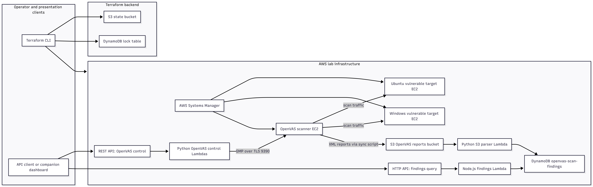

## Request And Data Flow

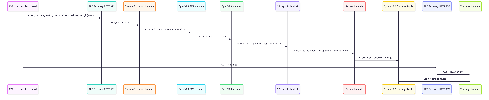

## Bootstrap Vs Infra

The repository is intentionally split into two Terraform roots.

| Layer | Folder | Run frequency | What it manages | Why it is separate |
|---|---|---:|---|---|
| Bootstrap | `terraform-bootstrap/` | Once per AWS account/project | S3 state bucket and DynamoDB lock table | Terraform needs the backend to exist before `terraform-infra/` can use remote state. |
| Main infrastructure | `terraform-infra/` | Whenever lab infrastructure changes | EC2, OpenVAS, Lambdas, APIs, IAM, S3 report buckets, DynamoDB findings, CloudWatch, Ansible artifacts | Keeps day-to-day infrastructure separate from foundational state management. |

## Terraform State Flow

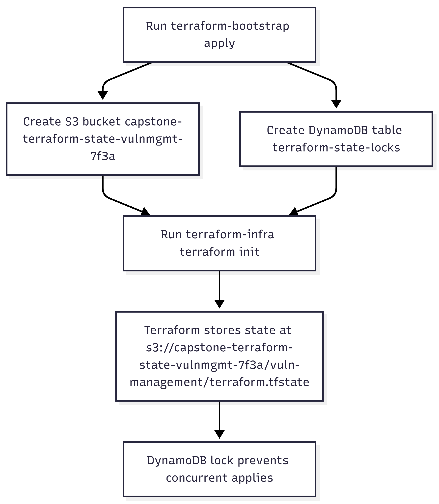

## Deployment Lifecycle

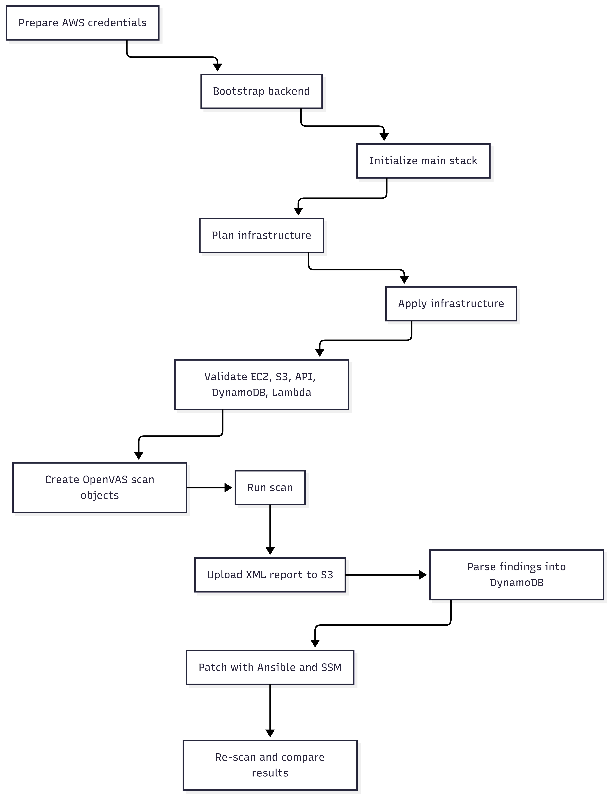

There is no checked-in one-command deployment script. The supported deployment path is the Terraform CLI sequence shown below.

## Screenshots Gallery

These screenshots are included in the repository as presentation evidence from the AWS console build-out. Some console views may include companion or manually created demonstration resources that are not declared in the current Terraform files; the Terraform sections below remain the source of truth for what this repository provisions.

| IAM users | EC2 lab fleet |
|---|---|
| 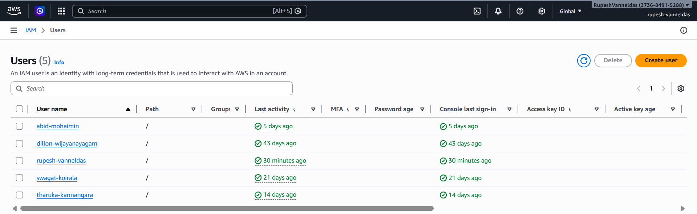 | 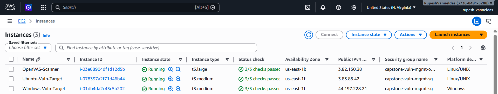 |

| API Gateway inventory | REST and HTTP APIs |
|---|---|
| 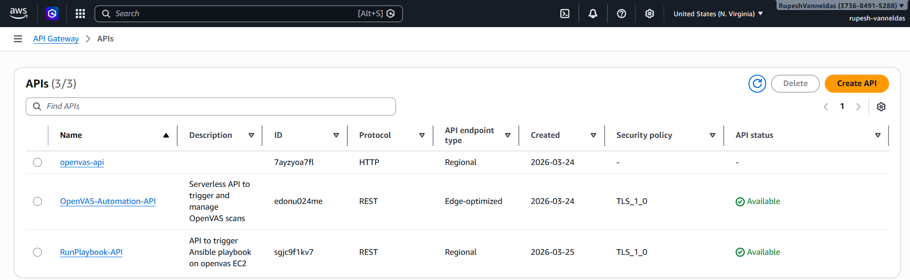 | 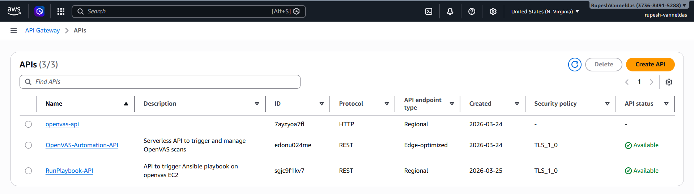 |

| Lambda functions | S3 buckets |
|---|---|
| 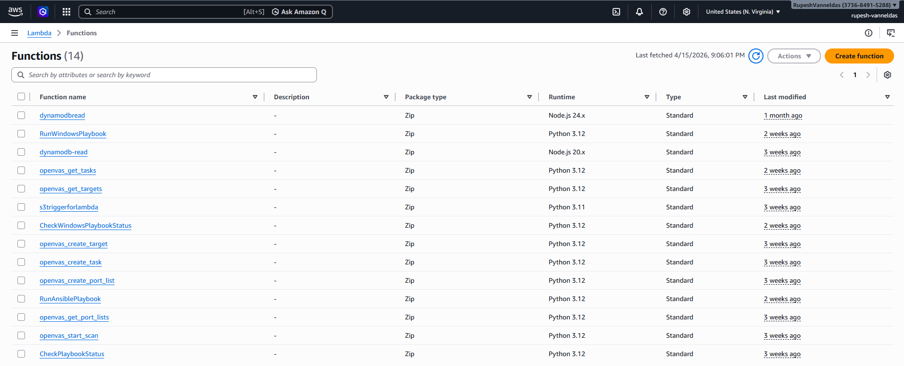 | 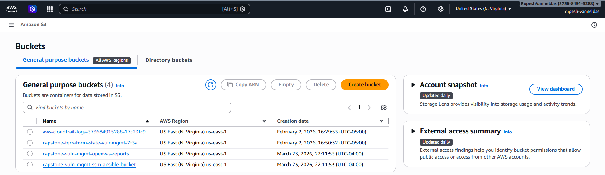 |

| DynamoDB tables |
|---|
| 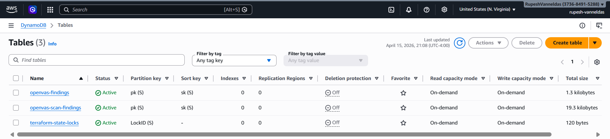 |

## Prerequisites

| Requirement | Notes |
|---|---|
| AWS account | Use an isolated lab account or sandbox account. The stack creates intentionally vulnerable targets. |
| AWS credentials | Configure credentials for Terraform and AWS CLI before running commands. |
| Terraform | Version 1.5 or newer. |
| AWS region | The repository is configured for `us-east-1`. |
| Existing VPC | `terraform-infra/provider.tf` currently references VPC ID `vpc-05e41bc3fcd905919`. Update this before deploying in another account. |
| EC2 key pair | Optional. `key_name` defaults to `null` because SSM is the intended management path. |
| Ansible and SSM plugin | Required only for running playbooks from a control machine. |
| Python and zip tooling | Needed if Lambda artifacts are rebuilt locally. |

## Quick Start

### 1. Clone And Enter The Repository

```bash
git clone https://github.com/InfraCrawlers/EVAPA-AWS-Infra.git
cd EVAPA-AWS-Infra
```

### 2. Bootstrap Terraform State

```bash
cd terraform-bootstrap
terraform init
terraform plan
terraform apply
```

This creates:

- S3 bucket `capstone-terraform-state-vulnmgmt-7f3a`
- DynamoDB table `terraform-state-locks`

### 3. Configure Main Infrastructure Inputs

Create a local variable file if you need to override defaults:

```hcl
# terraform-infra/terraform.tfvars
project_name  = "capstone-vuln-mgmt"
instance_type = "t3.medium"
key_name      = null
gmp_user      = "admin"
gmp_password  = "replace-with-a-strong-lab-password"
```

Before applying in a new AWS account, update the VPC selection in `terraform-infra/provider.tf`.

### 4. Deploy The Main Stack

```bash
cd ../terraform-infra
terraform init
terraform validate
terraform plan
terraform apply
```

OpenVAS initialization can take time because the user-data script installs Docker, downloads Greenbone containers, starts the stack, and configures a report sync cron job.

## Required Variables

| Variable | Default | Purpose |
|---|---|---|
| `project_name` | `capstone-vuln-mgmt` | Prefix used for project resources such as buckets, roles, and tags. |
| `instance_type` | `t3.medium` | EC2 type for the Ubuntu and Windows target instances. |
| `key_name` | `null` | Optional EC2 key pair. Leave null when managing instances with SSM. |
| `gmp_user` | `admin` | OpenVAS GMP username passed to OpenVAS control Lambdas. |
| `gmp_password` | `admin` | OpenVAS GMP password passed to OpenVAS control Lambdas. Override for any real lab run. |

## Deployment Order

1. Run `terraform-bootstrap` first.
2. Confirm the S3 state bucket and DynamoDB lock table exist.
3. Update the VPC ID in `terraform-infra/provider.tf` if deploying outside the original AWS account.
4. Confirm Lambda zip artifacts and `packages/gvm_layer.zip` exist.
5. Run `terraform-infra`.
6. Wait for EC2 user-data initialization, especially the OpenVAS scanner.
7. Validate APIs, buckets, DynamoDB, Lambda logs, and EC2 status.
8. Run scans, upload reports, parse findings, and run patching playbooks.

## Validation Steps

After `terraform apply`, validate the deployment from multiple angles:

```bash
terraform output
terraform output api_base_url
aws ec2 describe-instances --region us-east-1
aws s3 ls
aws dynamodb describe-table --table-name openvas-scan-findings --region us-east-1
aws logs describe-log-groups --log-group-name-prefix /aws/lambda --region us-east-1
```

The `api_base_url` output is the OpenVAS control REST API stage URL. The findings HTTP API created in `apigateway.tf` does not currently have a Terraform output, so retrieve that endpoint from the API Gateway console or add an output if needed.

## Usage Examples

Replace `API_BASE_URL` with `terraform output -raw api_base_url`.

Create a port list:

```bash
curl -X POST "$API_BASE_URL/port-lists" \
  -H "Content-Type: application/json" \
  -d '{"name":"Full TCP","port_range":"T:1-65535"}'
```

Create a target:

```bash
curl -X POST "$API_BASE_URL/targets" \
  -H "Content-Type: application/json" \
  -d '{"name":"Ubuntu Target","hosts":["10.0.0.10"],"port_list_name":"Full TCP","alive_test":"Consider Alive"}'
```

Create a scan task:

```bash
curl -X POST "$API_BASE_URL/tasks" \
  -H "Content-Type: application/json" \
  -d '{"name":"Ubuntu Full Scan","target_name":"Ubuntu Target"}'
```

Start a scan by task ID:

```bash
curl -X POST "$API_BASE_URL/tasks/<task_id>/start"
```

Read parsed findings through the HTTP API:

```bash
FINDINGS_API_URL="https://<api-id>.execute-api.us-east-1.amazonaws.com/v1"
curl "$FINDINGS_API_URL/findings"
```

## Patching Workflow

The repository includes Ansible assets under `terraform-infra/playbooks/`.

```bash
cd terraform-infra
ansible-galaxy collection install amazon.aws community.aws community.windows ansible.windows
ansible-playbook -i playbooks/inventory.ini playbooks/linux_patching.yml
ansible-playbook -i playbooks/inventory.ini playbooks/win_patching.yml
```

The checked-in `playbooks/inventory.ini` contains sample EC2 instance IDs from a previous run. Update those IDs after your own `terraform apply` before running playbooks. The inventory is configured for AWS SSM transport, which avoids direct SSH/RDP for patch operations.

## Cleanup And Destroy

Destroy the main lab before destroying the backend:

```bash
cd terraform-infra
terraform destroy
```

If S3 report uploads were created outside Terraform, empty the report bucket before destroy:

```bash
aws s3 rm s3://capstone-vuln-mgmt-openvas-reports --recursive
```

Destroy the bootstrap backend only when you no longer need the remote state:

```bash
cd ../terraform-bootstrap
terraform destroy
```

The bootstrap S3 bucket has `force_destroy = false`, so Terraform will not delete it while objects remain. This is intentional state-safety behavior.

## Security Considerations

- The EC2 targets are intentionally vulnerable. Keep them isolated.
- The OpenVAS security group currently exposes ports `22`, `80`, and `443` to `0.0.0.0/0`.
- API Gateway methods use `authorization = "NONE"` in the current Terraform.
- `gmp_user` and `gmp_password` have weak defaults and are passed to Lambda environment variables.
- `provider.tf` contains a hardcoded VPC ID, which should be parameterized before reuse.
- The SSM role attaches `AmazonSSMFullAccess`, which is broad for a production environment.
- The SSM bucket has public access blocked and versioning enabled. The OpenVAS reports bucket does not currently define an explicit public access block in Terraform.
- Lambda-to-OpenVAS access is limited to TCP `9390` through the Lambda security group and OpenVAS security group relationship.
- Terraform state is stored in an encrypted S3 bucket with DynamoDB locking.

## Limitations

- This is a lab environment, not a production deployment.
- No `.github/workflows` CI/CD pipeline is present in the repository.
- OpenVAS startup depends on public package repositories and container pulls during EC2 user-data execution.
- Some Lambda zip files are committed as deployment artifacts; rebuild steps are manual.
- The findings HTTP API endpoint is not currently exposed as a Terraform output.
- The report sync script contains project-specific values such as bucket name and default OpenVAS credentials.
- There is no NAT Gateway, private endpoint design, or multi-account deployment model in the current Terraform.
- The companion dashboard described in the provided dashboard documentation is not part of this repository.

## Future Improvements

- Parameterize VPC and subnet selection instead of hardcoding the VPC ID.
- Add Terraform outputs for the findings HTTP API and important bucket/table names.
- Store OpenVAS credentials in AWS Secrets Manager or SSM Parameter Store.
- Restrict OpenVAS public ingress to trusted IP ranges or private access paths.
- Add public access block and encryption configuration for the OpenVAS reports bucket.
- Replace broad IAM permissions with least-privilege policies.
- Add CI checks for `terraform fmt`, `terraform validate`, security scanning, and Markdown linting.
- Add automated Lambda packaging or build scripts.
- Add a formal module structure if the project grows beyond one lab environment.
- Add cost estimates and budget alarms directly in Terraform.

## Project Milestones

The provided milestone materials frame the project as a Seneca Polytechnic Group 4 capstone focused on AWS-based vulnerability assessment, patch orchestration, reporting, and dashboard presentation. The repository represents the infrastructure implementation portion of that capstone.

| Milestone theme | Evidence reflected in this repo |
|---|---|
| Scope and objectives | AWS vulnerability management pipeline for Linux and Windows EC2 instances. |
| Requirements and planning | Terraform, OpenVAS, SSM, S3, DynamoDB, Lambda, and API Gateway selected as implementation components. |
| Environment blueprint | Remote state, AWS account resources, EC2 targets, scanner, storage, and automation boundaries. |
| Implementation and demo | Terraform infrastructure, Lambda source, report pipeline, Ansible playbooks, and AWS console screenshots. |
| Presentation readiness | Organized root and folder READMEs, diagrams, lifecycle instructions, and security/limitations sections. |

## Highlights

- Designed and documented a two-stage Terraform deployment with remote state and state locking.
- Automated AWS infrastructure for a vulnerability management lab using EC2, S3, DynamoDB, IAM, Lambda, API Gateway, CloudWatch, and SSM.
- Integrated OpenVAS/Greenbone with serverless control functions using python-gvm and API Gateway.
- Built a report ingestion pipeline from OpenVAS XML in S3 to structured high-severity DynamoDB records.
- Practiced cloud security tradeoffs, including isolation, IAM scope, scanner access, state security, and known lab limitations.
- Produced presentation-ready technical documentation with architecture diagrams, workflows, and operator runbooks.

## References And Acknowledgements

- Greenbone Community Edition / OpenVAS for vulnerability scanning.
- HashiCorp Terraform and the Terraform AWS provider for Infrastructure as Code.
- AWS services used in the repository: EC2, IAM, S3, DynamoDB, Lambda, API Gateway, Systems Manager, and CloudWatch Logs.
- Seneca Polytechnic CYT300 capstone milestone materials and the supplied EVAPA dashboard documentation.
- Group 4 capstone contributors listed in the provided project materials.

## Documentation Map

- [`terraform-bootstrap/README.md`](terraform-bootstrap/README.md) - backend bootstrap runbook.
- [`terraform-infra/README.md`](terraform-infra/README.md) - main infrastructure runbook.
- [`terraform-infra/lambda/README.md`](terraform-infra/lambda/README.md) - Lambda functions and packaging.
- [`terraform-infra/scripts/README.md`](terraform-infra/scripts/README.md) - EC2 user-data and report sync scripts.
- [`terraform-infra/playbooks/README.md`](terraform-infra/playbooks/README.md) - Ansible and SSM playbooks.
- [`terraform-infra/packages/README.md`](terraform-infra/packages/README.md) - Lambda layer artifact.
