# OpenVAS Screenshots

This folder contains OpenVAS web interface screenshots used as visual evidence for the vulnerability scanning workflow. The images support the project README by showing the scanner dashboard, scan tasks, reports, findings, asset views, security information, and scan configuration screens.

## Naming Convention

- Use lowercase kebab-case.
- Prefix each image with `openvas-`.
- Use a name that describes the screen or workflow stage.
- Avoid generic names such as `image1.png`.

## Workflow Gallery

| Dashboard overview |
|---|
| 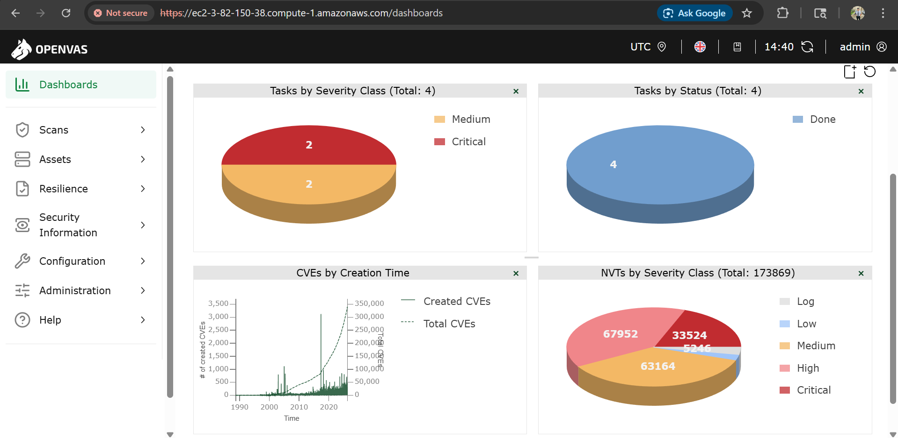 |
| Shows the main OpenVAS dashboard with task severity, task status, CVE creation time, and NVT severity charts. |

| Task summary | Task list |
|---|---|
| 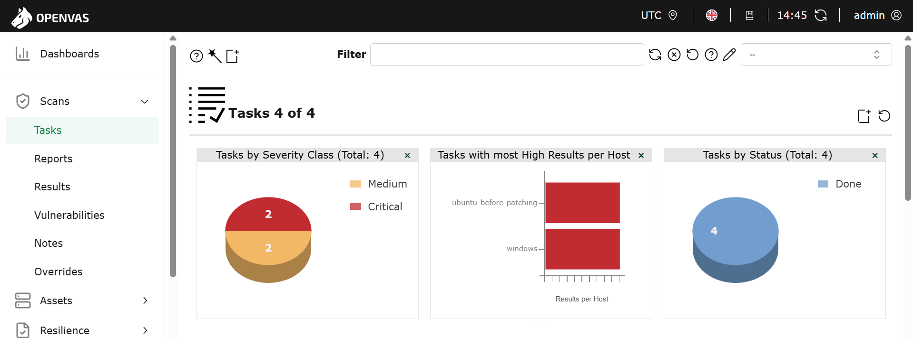 | 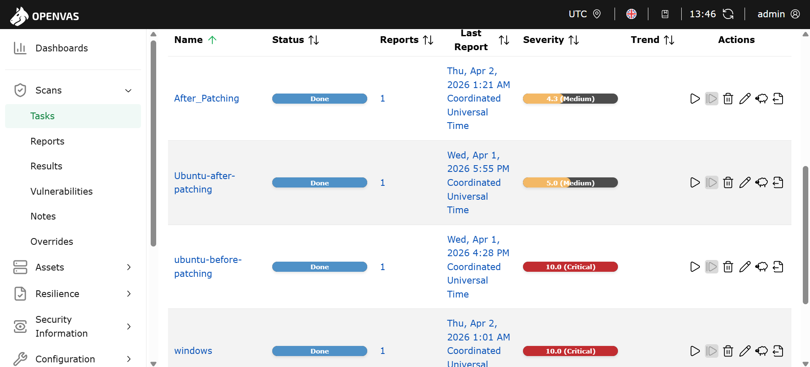 |
| Task dashboard with severity, high-results-per-host, and status charts. | Completed scan tasks with report links and severity ratings. |

| Reports summary | Report severity counts |
|---|---|
| 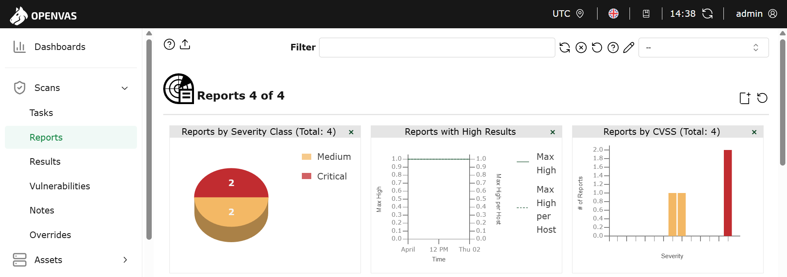 | 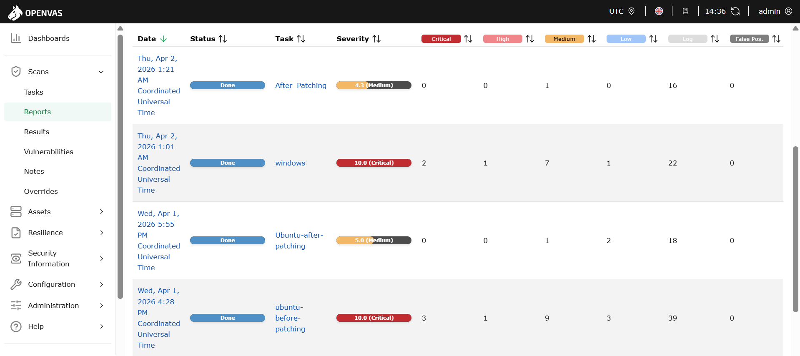 |
| Report dashboard with severity and CVSS chart summaries. | Per-report critical, high, medium, low, and log finding counts. |

| Results summary | Critical findings |
|---|---|
| 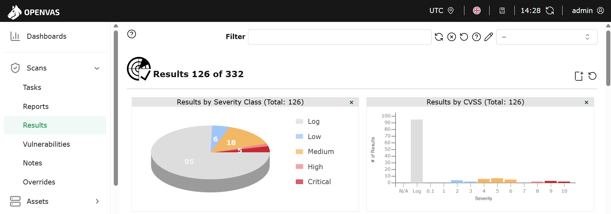 | 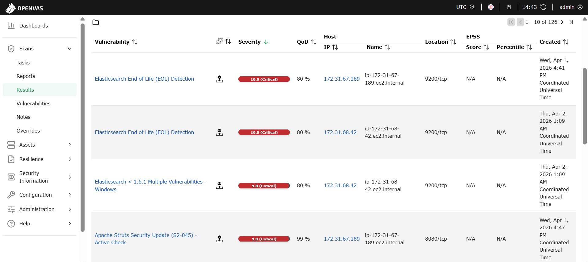 |
| Results dashboard with severity class and CVSS distribution. | Findings list showing critical vulnerabilities and affected hosts. |

| Vulnerability summary |
|---|
| 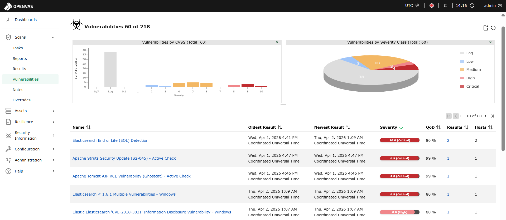 |
| Vulnerability dashboard and high-severity vulnerability list. |

## Asset And Inventory Views

| Hosts severity and topology |
|---|
| 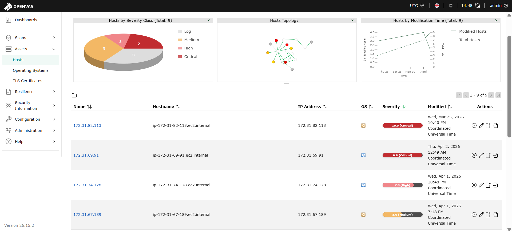 |
| Host severity distribution, host topology, and discovered host inventory. |

| Operating systems severity | TLS certificate inventory |
|---|---|
| 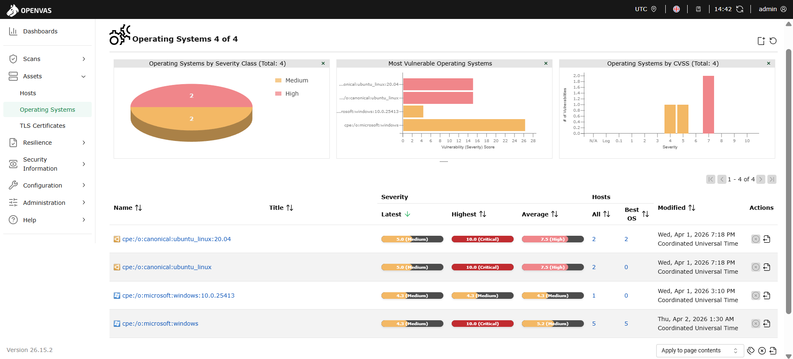 | 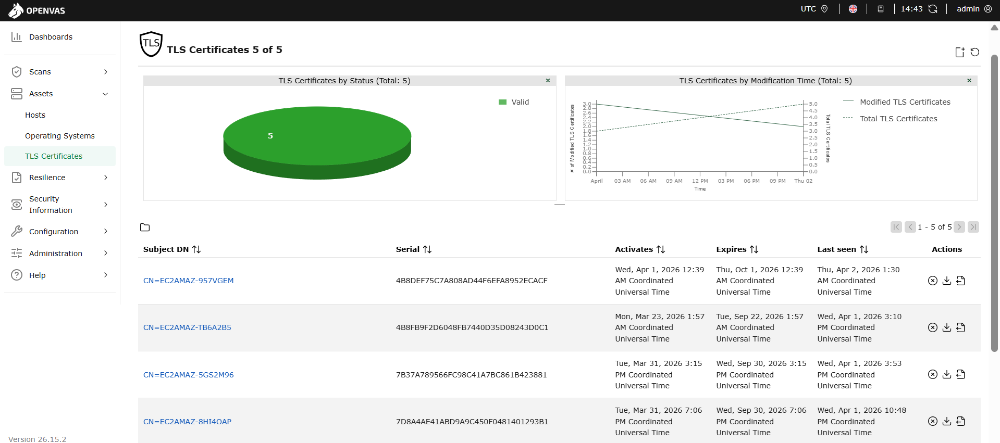 |
| Operating system inventory and vulnerability severity distribution. | TLS certificate inventory and validity status. |

## Security Information Views

| NVT security information |
|---|
| 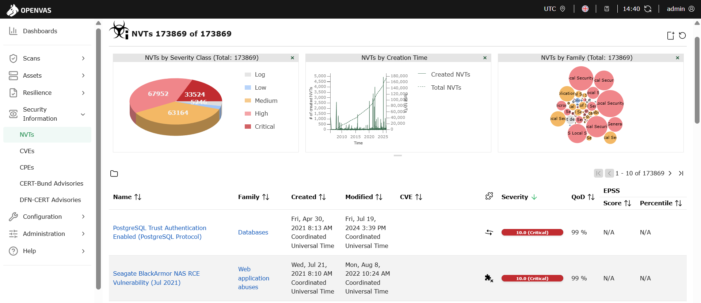 |
| Network Vulnerability Test catalog summary and NVT records. |

| CVE security information | CPE security information |
|---|---|
| 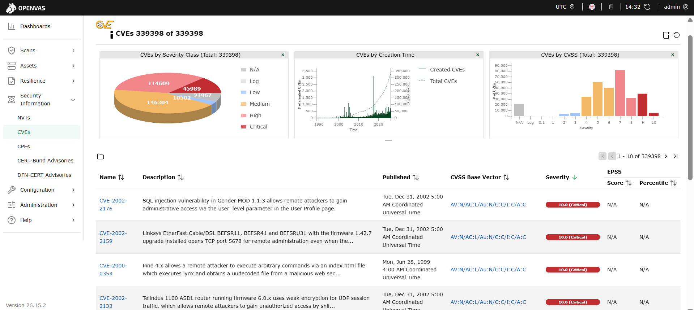 | 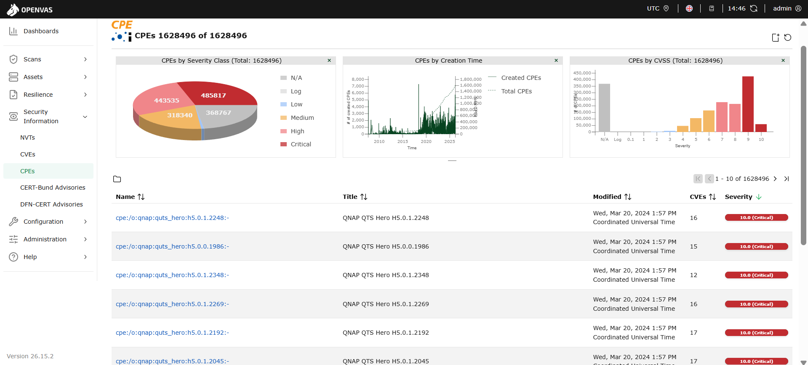 |
| CVE catalog summary and CVE records. | CPE catalog summary and CPE records. |

## Configuration Views

| Configured targets | Port lists |
|---|---|
| 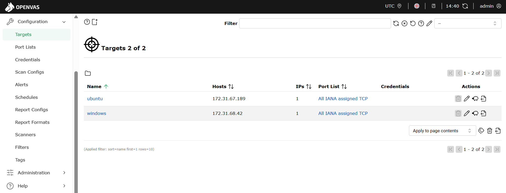 | 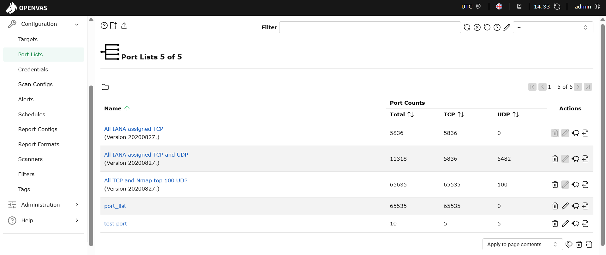 |
| Configured scan targets for Ubuntu and Windows hosts. | Available OpenVAS port lists and TCP/UDP coverage. |

| Scan configs |
|---|
| 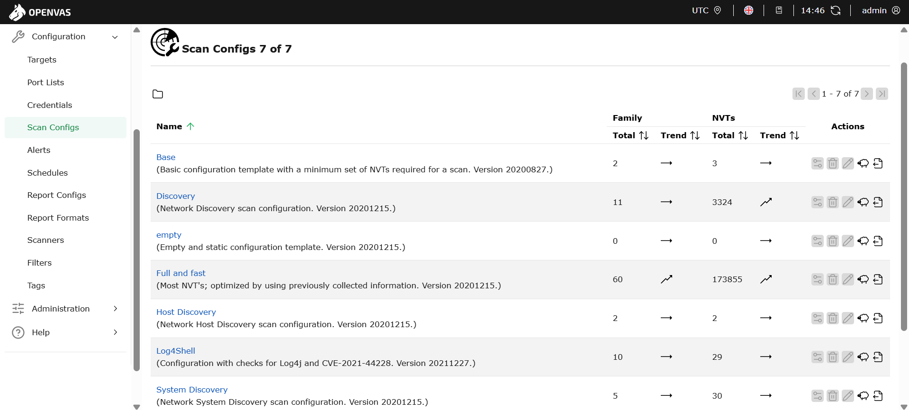 |
| Available scan configurations such as Base, Discovery, Full and fast, and Log4Shell. |
