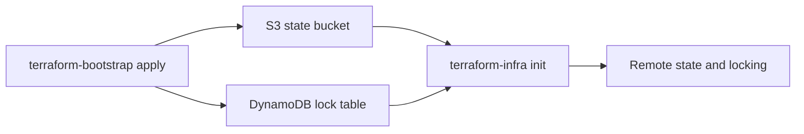
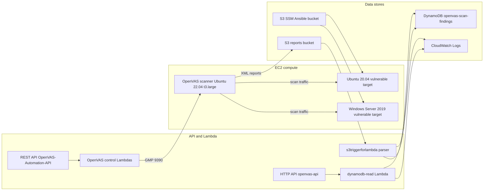
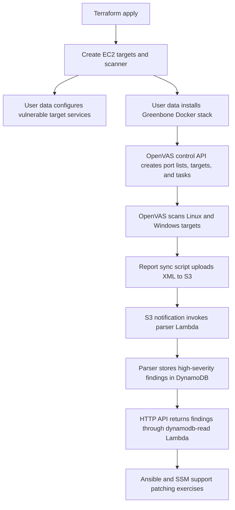
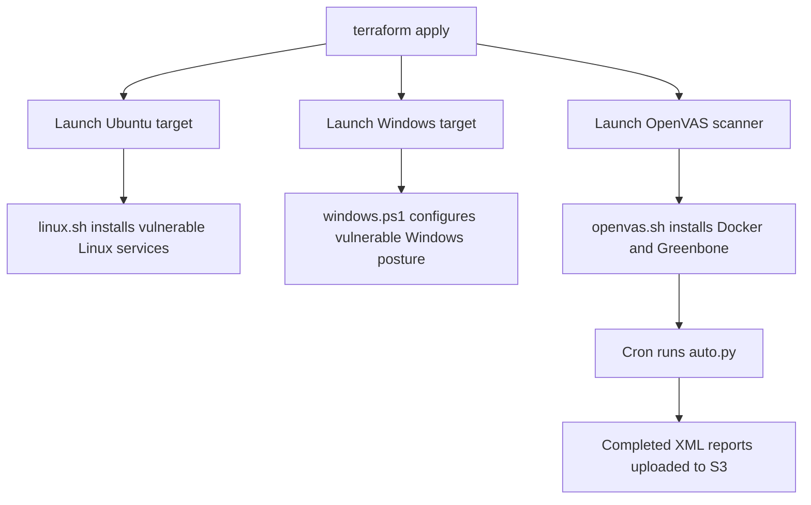
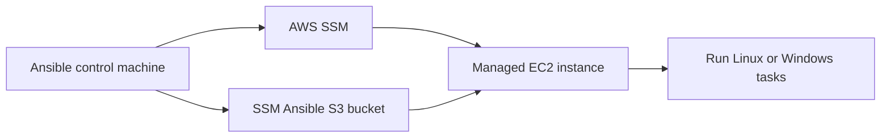
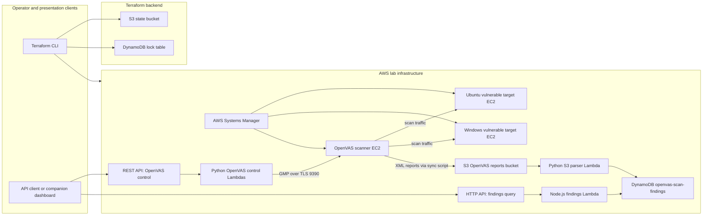
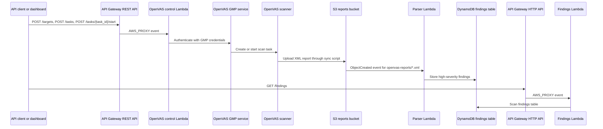
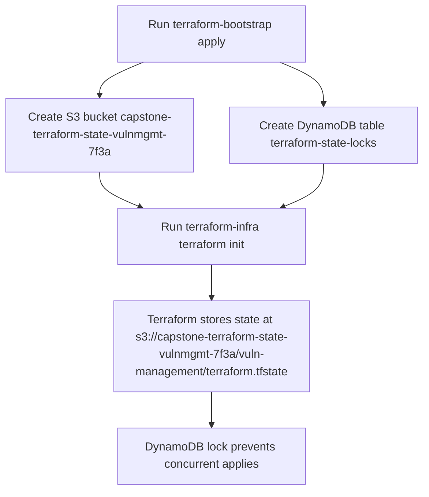

# Terraform Bootstrap

```mermaid
flowchart LR
  A["terraform-bootstrap apply"] --> B["S3 state bucket"]
  A --> C["DynamoDB lock table"]
  B --> D["terraform-infra init"]
  C --> D
  D --> E["Remote state and locking"]
```

# Architecture

```mermaid
flowchart LR
  subgraph Compute["EC2 compute"]
    OpenVAS["OpenVAS scanner Ubuntu 22.04 t3.large"]
    Linux["Ubuntu 20.04 vulnerable target"]
    Windows["Windows Server 2019 vulnerable target"]
  end

  subgraph API["API and Lambda"]
    RestAPI["REST API OpenVAS-Automation-API"]
    OpenVASLambdas["OpenVAS control Lambdas"]
    HttpAPI["HTTP API openvas-api"]
    ReadLambda["dynamodb-read Lambda"]
    ParserLambda["s3triggerforlambda parser"]
  end

  subgraph Data["Data stores"]
    Reports["S3 reports bucket"]
    SSMBucket["S3 SSM Ansible bucket"]
    Findings["DynamoDB openvas-scan-findings"]
    Logs["CloudWatch Logs"]
  end

  RestAPI --> OpenVASLambdas
  OpenVASLambdas -->|"GMP 9390"| OpenVAS
  OpenVAS -->|"scan traffic"| Linux
  OpenVAS -->|"scan traffic"| Windows
  OpenVAS -->|"XML reports"| Reports
  Reports --> ParserLambda
  ParserLambda --> Findings
  HttpAPI --> ReadLambda
  ReadLambda --> Findings
  ParserLambda --> Logs
  ReadLambda --> Logs
  SSMBucket --> Linux
  SSMBucket --> Windows
```

# Main Workflow

```mermaid
flowchart TD
  A["Terraform apply"] --> B["Create EC2 targets and scanner"]
  B --> C["User data configures vulnerable target services"]
  B --> D["User data installs Greenbone Docker stack"]
  D --> E["OpenVAS control API creates port lists, targets, and tasks"]
  E --> F["OpenVAS scans Linux and Windows targets"]
  F --> G["Report sync script uploads XML to S3"]
  G --> H["S3 notification invokes parser Lambda"]
  H --> I["Parser stores high-severity findings in DynamoDB"]
  I --> J["HTTP API returns findings through dynamodb-read Lambda"]
  J --> K["Ansible and SSM support patching exercises"]
```
# Execution Flow

```mermaid
flowchart TD
  A["terraform apply"] --> B["Launch Ubuntu target"]
  A --> C["Launch Windows target"]
  A --> D["Launch OpenVAS scanner"]
  B --> E["linux.sh installs vulnerable Linux services"]
  C --> F["windows.ps1 configures vulnerable Windows posture"]
  D --> G["openvas.sh installs Docker and Greenbone"]
  G --> H["Cron runs auto.py"]
  H --> I["Completed XML reports uploaded to S3"]
```

# SSM Transport Flow

```mermaid
flowchart LR
  A["Ansible control machine"] --> B["AWS SSM"]
  B --> C["Managed EC2 instance"]
  A --> D["SSM Ansible S3 bucket"]
  D --> C
  C --> E["Run Linux or Windows tasks"]
```

# Lab Architecture

```mermaid
flowchart LR
  subgraph Operator["Operator and presentation clients"]
    CLI["Terraform CLI"]
    Client["API client or companion dashboard"]
  end

  subgraph Backend["Terraform backend"]
    StateBucket["S3 state bucket"]
    LockTable["DynamoDB lock table"]
  end

  subgraph AWS["AWS lab infrastructure"]
    OpenVAS["OpenVAS scanner EC2"]
    Linux["Ubuntu vulnerable target EC2"]
    Windows["Windows vulnerable target EC2"]
    Reports["S3 OpenVAS reports bucket"]
    Findings["DynamoDB openvas-scan-findings"]
    RestAPI["REST API: OpenVAS control"]
    HttpAPI["HTTP API: findings query"]
    ControlLambdas["Python OpenVAS control Lambdas"]
    ParserLambda["Python S3 parser Lambda"]
    QueryLambda["Node.js findings Lambda"]
    SSM["AWS Systems Manager"]
  end

  CLI --> StateBucket
  CLI --> LockTable
  CLI --> AWS
  Client --> RestAPI
  RestAPI --> ControlLambdas
  ControlLambdas -->|"GMP over TLS 9390"| OpenVAS
  OpenVAS -->|"scan traffic"| Linux
  OpenVAS -->|"scan traffic"| Windows
  OpenVAS -->|"XML reports via sync script"| Reports
  Reports --> ParserLambda
  ParserLambda --> Findings
  Client --> HttpAPI
  HttpAPI --> QueryLambda
  QueryLambda --> Findings
  SSM --> Linux
  SSM --> Windows
  SSM --> OpenVAS
```

# Request And Data Flow

```mermaid
sequenceDiagram
  participant Client as API client or dashboard
  participant API as API Gateway REST API
  participant Lambda as OpenVAS control Lambda
  participant GVM as OpenVAS GMP service
  participant Scanner as OpenVAS scanner
  participant S3 as S3 reports bucket
  participant Parser as Parser Lambda
  participant DDB as DynamoDB findings table
  participant FindingsAPI as API Gateway HTTP API
  participant Query as Findings Lambda

  Client->>API: POST /targets, POST /tasks, POST /tasks/{task_id}/start
  API->>Lambda: AWS_PROXY event
  Lambda->>GVM: Authenticate with GMP credentials
  GVM->>Scanner: Create or start scan task
  Scanner->>S3: Upload XML report through sync script
  S3->>Parser: ObjectCreated event for openvas-reports/*.xml
  Parser->>DDB: Store high-severity findings
  Client->>FindingsAPI: GET /findings
  FindingsAPI->>Query: AWS_PROXY event
  Query->>DDB: Scan findings table
```

# Terraform State Flow

```mermaid
flowchart TD
  A["Run terraform-bootstrap apply"] --> B["Create S3 bucket capstone-terraform-state-vulnmgmt-7f3a"]
  A --> C["Create DynamoDB table terraform-state-locks"]
  B --> D["Run terraform-infra terraform init"]
  C --> D
  D --> E["Terraform stores state at s3://capstone-terraform-state-vulnmgmt-7f3a/vuln-management/terraform.tfstate"]
  E --> F["DynamoDB lock prevents concurrent applies"]
```

# Deployment Lifecycle

```mermaid
flowchart LR
  A["Prepare AWS credentials"] --> B["Bootstrap backend"]
  B --> C["Initialize main stack"]
  C --> D["Plan infrastructure"]
  D --> E["Apply infrastructure"]
  E --> F["Validate EC2, S3, API, DynamoDB, Lambda"]
  F --> G["Create OpenVAS scan objects"]
  G --> H["Run scan"]
  H --> I["Upload XML report to S3"]
  I --> J["Parse findings into DynamoDB"]
  J --> K["Patch with Ansible and SSM"]
  K --> L["Re-scan and compare results"]
```