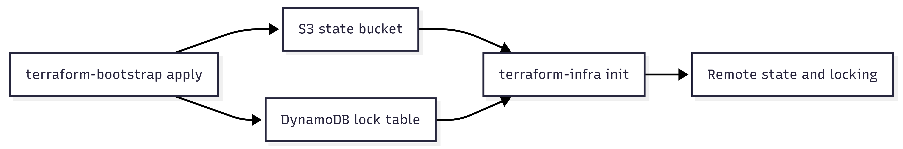

# Terraform Bootstrap

This folder contains the one-time Terraform stack that creates the remote backend used by the main EVAPA infrastructure stack.

Terraform cannot store state in an S3 backend until that S3 bucket exists. For that reason, backend resources are separated from the main lab infrastructure and deployed first.

## What This Folder Manages

| Resource | Terraform address | Name | Purpose |
|---|---|---|---|
| S3 bucket | `aws_s3_bucket.terraform_state` | `capstone-terraform-state-vulnmgmt-7f3a` | Stores remote Terraform state for `terraform-infra/`. |
| S3 bucket versioning | `aws_s3_bucket_versioning.versioning` | Enabled | Keeps historical state object versions. |
| S3 server-side encryption | `aws_s3_bucket_server_side_encryption_configuration.encryption` | AES256 | Encrypts state objects at rest. |
| S3 public access block | `aws_s3_bucket_public_access_block.block_public` | Enabled | Blocks public ACLs and bucket policies. |
| DynamoDB table | `aws_dynamodb_table.terraform_locks` | `terraform-state-locks` | Provides Terraform state locking through the `LockID` hash key. |

## How It Connects To The Project

`terraform-infra/backend.tf` points to the resources created here:

```hcl
terraform {
  backend "s3" {
    bucket         = "capstone-terraform-state-vulnmgmt-7f3a"
    key            = "vuln-management/terraform.tfstate"
    region         = "us-east-1"
    dynamodb_table = "terraform-state-locks"
    encrypt        = true
  }
}
```

Run this folder before running `terraform-infra/`.



## Prerequisites

| Requirement | Notes |
|---|---|
| AWS credentials | Use credentials with permission to create S3 buckets, S3 bucket settings, and DynamoDB tables. |
| Terraform | Version compatible with the AWS provider used by the project. Terraform 1.5+ is recommended. |
| Region | The provider is hardcoded to `us-east-1`. |
| Unique bucket name | S3 bucket names are globally unique. If this bucket already exists in another account, choose a new name and update `terraform-infra/backend.tf` to match. |

## Commands

Run from this directory:

```bash
cd terraform-bootstrap
terraform init
terraform fmt -check
terraform validate
terraform plan
terraform apply
```

## Required Variables

This stack does not define input variables. Resource names are currently hardcoded in `main.tf`.

## Outputs

This stack does not define Terraform outputs. Verify the backend with AWS CLI or the AWS console:

```bash
aws s3api head-bucket --bucket capstone-terraform-state-vulnmgmt-7f3a --region us-east-1
aws dynamodb describe-table --table-name terraform-state-locks --region us-east-1
```

## When To Re-run

Re-run this folder only when you intentionally change backend infrastructure, such as:

- Renaming the state bucket.
- Changing encryption or versioning behavior.
- Recreating the DynamoDB lock table.

For normal lab changes, run Terraform from `terraform-infra/` instead.

## Destroy Guidance

Do not destroy this stack while the main infrastructure still exists or while state history is still needed.

Safe cleanup order:

1. Destroy `terraform-infra/`.
2. Back up or intentionally remove remote state objects.
3. Destroy `terraform-bootstrap/`.

The state bucket has `force_destroy = false`, so Terraform will not delete it while objects remain.

## Common Mistakes

| Problem | Cause | Fix |
|---|---|---|
| `terraform-infra init` fails with backend bucket not found | Bootstrap was not applied first. | Apply this folder, then retry `terraform init` in `terraform-infra/`. |
| S3 bucket creation fails with name conflict | Bucket names are global across AWS. | Rename the bucket in `main.tf` and update `terraform-infra/backend.tf`. |
| State lock errors | A previous Terraform run may have been interrupted. | Check the DynamoDB lock table before forcing unlock. Use `terraform force-unlock` only when you are sure no apply is running. |
| Access denied | AWS credentials do not have S3 or DynamoDB permissions. | Use an IAM principal with backend provisioning permissions. |
| Accidental backend destroy | The backend contains the state history for the main stack. | Restore from S3 object versions or backups if available. |

## Troubleshooting

Check which AWS account Terraform is using:

```bash
aws sts get-caller-identity
```

Check the bucket encryption configuration:

```bash
aws s3api get-bucket-encryption \
  --bucket capstone-terraform-state-vulnmgmt-7f3a \
  --region us-east-1
```

Check bucket versioning:

```bash
aws s3api get-bucket-versioning \
  --bucket capstone-terraform-state-vulnmgmt-7f3a \
  --region us-east-1
```

Check the lock table:

```bash
aws dynamodb describe-table \
  --table-name terraform-state-locks \
  --region us-east-1
```

## Design Notes

- Backend state is treated as foundational infrastructure.
- Public access is explicitly blocked for the state bucket.
- Versioning is enabled to help recover from accidental state overwrites.
- DynamoDB uses on-demand billing (`PAY_PER_REQUEST`) to avoid capacity planning for a lab project.
