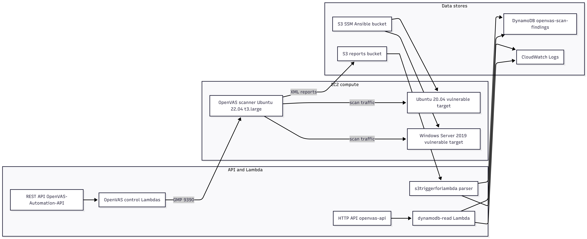
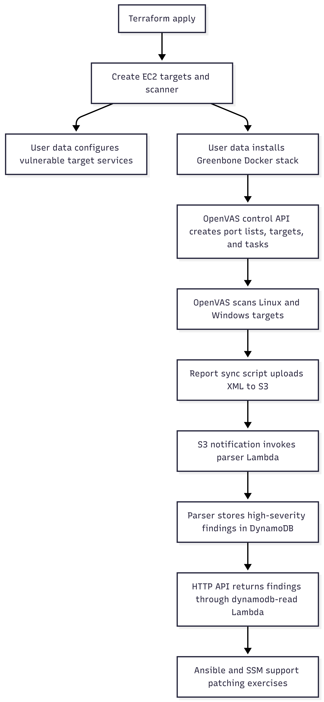

# Terraform Infra

This folder is the main Terraform root for the EVAPA vulnerability management lab. It provisions the AWS infrastructure that supports vulnerable targets, OpenVAS scanning, report ingestion, API access, and patching automation.

Run `terraform-bootstrap/` before this folder. The backend in `backend.tf` expects the bootstrap S3 bucket and DynamoDB lock table to already exist.

## Purpose

`terraform-infra/` exists to build the operational lab environment:

- EC2 instances for Linux, Windows, and OpenVAS scanning.
- Security groups that allow scanner-to-target traffic and Lambda-to-OpenVAS GMP traffic.
- IAM roles and policies for SSM, S3, DynamoDB, Lambda logging, and Lambda VPC access.
- S3 buckets for OpenVAS reports and Ansible/SSM transport.
- DynamoDB table for parsed high-severity scan findings.
- Lambda functions for OpenVAS control, report parsing, and findings queries.
- API Gateway routes for scan orchestration and findings retrieval.
- CloudWatch log groups for Lambda observability.
- Ansible inventory and playbook assets used during patching exercises.

## Folder Layout

```text
terraform-infra/
|-- backend.tf
|-- provider.tf
|-- versions.tf
|-- variables.tf
|-- ec2.tf
|-- sg.tf
|-- iam.tf
|-- s3.tf
|-- dynamodb.tf
|-- lambda_api.tf
|-- lambda_parser.tf
|-- openvas_lambda.tf
|-- openvas_api.tf
|-- apigateway.tf
|-- cloudwatch.tf
|-- ansible_hosts.tf
|-- outputs.tf
|-- lambda/
|-- packages/
|-- playbooks/
`-- scripts/
```

The subfolders are not Terraform modules in the current implementation. They are source and artifact directories consumed by this root module.

## File Responsibilities

| File | Responsibility |
|---|---|
| `backend.tf` | Configures S3 remote state and DynamoDB locking from the bootstrap stack. |
| `provider.tf` | Pins Terraform/AWS provider versions, configures `us-east-1`, and selects the existing VPC/subnets. |
| `versions.tf` | Looks up AMIs for Ubuntu 20.04, Ubuntu 22.04, Windows Server 2019, and Amazon Linux 2. |
| `variables.tf` | Defines project inputs: project name, EC2 type, key pair, and OpenVAS GMP credentials. |
| `ec2.tf` | Creates Ubuntu target, Windows target, and OpenVAS scanner instances. |
| `sg.tf` | Creates target, scanner, and Lambda security groups. |
| `iam.tf` | Creates EC2/SSM, Lambda, S3, and DynamoDB IAM permissions. |
| `s3.tf` | Creates OpenVAS report bucket and SSM/Ansible transport bucket. |
| `dynamodb.tf` | Creates the `openvas-scan-findings` DynamoDB table. |
| `openvas_lambda.tf` | Creates Python OpenVAS control Lambdas and the python-gvm Lambda layer. |
| `openvas_api.tf` | Creates the REST API for OpenVAS scan-management actions. |
| `lambda_parser.tf` | Creates the S3-triggered XML parser Lambda and S3 notification. |
| `lambda_api.tf` | Creates the Node.js findings-read Lambda and DynamoDB read policy. |
| `apigateway.tf` | Creates the HTTP API route `GET /findings`. |
| `cloudwatch.tf` | Creates 7-day CloudWatch log groups for parser and read Lambdas. |
| `ansible_hosts.tf` | Generates a local `hosts.ini` file after apply. |
| `outputs.tf` | Outputs EC2 instance IDs and the OpenVAS REST API base URL. |

## Architecture



## Resources Managed

| Category | Resources |
|---|---|
| EC2 | `aws_instance.linux_ubuntu`, `aws_instance.windows`, `aws_instance.openvas` |
| Security groups | `aws_security_group.ec2_sg`, `aws_security_group.openvas_sg`, `aws_security_group.lambda_sg` |
| IAM | EC2 SSM role/profile, Lambda parser/read role, OpenVAS control Lambda role, S3 upload policy, DynamoDB policies |
| S3 | `${project_name}-openvas-reports`, `${project_name}-ssm-ansible-bucket`, placeholder key `openvas-reports/` |
| DynamoDB | `openvas-scan-findings` |
| Lambda | OpenVAS control Lambdas, `s3triggerforlambda`, `dynamodb-read`, `python_gvm_library` layer |
| API Gateway | REST API `OpenVAS-Automation-API`, HTTP API `openvas-api` |
| CloudWatch | Log groups for parser and findings-read Lambda functions |
| Local files | Generated `hosts.ini` inventory from `ansible_hosts.tf` |

## Main Workflow



## Prerequisites

| Requirement | Notes |
|---|---|
| Bootstrap backend | Run `terraform-bootstrap/` first. |
| AWS credentials | Need permissions for EC2, IAM, S3, DynamoDB, Lambda, API Gateway, CloudWatch, and Systems Manager. |
| Terraform | `required_version = ">= 1.5.0"`. |
| AWS provider | `hashicorp/aws ~> 5.0`. |
| Region | Provider is configured for `us-east-1`. |
| Existing VPC | `provider.tf` currently uses `vpc-05e41bc3fcd905919`. Change before deploying elsewhere. |
| Lambda artifacts | Zip files under `lambda/*/` and `packages/gvm_layer.zip` must exist before apply. |
| Internet access from EC2 | User-data scripts download packages, archives, AWS CLI, Docker, and Greenbone containers. |

## Required Variables

| Variable | Type | Default | Required? | Notes |
|---|---|---|---|---|
| `project_name` | string | `capstone-vuln-mgmt` | No | Used for tags and several resource names. |
| `instance_type` | string | `t3.medium` | No | Used by Linux and Windows targets. |
| `key_name` | string/null | `null` | No | Optional EC2 key pair. SSM is the preferred management path. |
| `gmp_user` | string | `admin` | No | OpenVAS GMP username passed to control Lambdas. |
| `gmp_password` | sensitive string | `admin` | No | Override in `terraform.tfvars` for real lab usage. |

Example `terraform.tfvars`:

```hcl
project_name  = "capstone-vuln-mgmt"
instance_type = "t3.medium"
key_name      = null
gmp_user      = "admin"
gmp_password  = "replace-this-password"
```

## Commands

```bash
cd terraform-infra
terraform init
terraform fmt -check
terraform validate
terraform plan
terraform apply
```

Check outputs:

```bash
terraform output
terraform output -raw api_base_url
```

## Outputs

| Output | Description |
|---|---|
| `ec2_instances` | Map of Terraform-created EC2 instance IDs for `ubuntu`, `windows`, and `openvas`. |
| `api_base_url` | Invoke URL for the REST API Gateway stage used by OpenVAS control endpoints. |

The HTTP API URL for `GET /findings` is not currently exposed as an output. Add an output for `aws_apigatewayv2_stage.api_stage.invoke_url` if you want it available from Terraform.

## API Endpoints

The REST API in `openvas_api.tf` exposes these OpenVAS control routes:

| Method | Path | Lambda | Purpose |
|---|---|---|---|
| `POST` | `/port-lists` | `openvas_create_port_list` | Create an OpenVAS port list. |
| `GET` | `/port-lists` | `openvas_get_port_lists` | List OpenVAS port lists. |
| `POST` | `/targets` | `openvas_create_target` | Create an OpenVAS target. |
| `GET` | `/targets` | `openvas_get_targets` | List OpenVAS targets. |
| `POST` | `/tasks` | `openvas_create_task` | Create an OpenVAS scan task. |
| `GET` | `/tasks` | `openvas_get_tasks` | List OpenVAS scan tasks. |
| `POST` | `/tasks/{task_id}/start` | `openvas_start_scan` | Start a scan task. |

The HTTP API in `apigateway.tf` exposes:

| Method | Path | Lambda | Purpose |
|---|---|---|---|
| `GET` | `/findings` | `dynamodb-read` | Return items from `openvas-scan-findings`. |

## Deployment Validation

Confirm Terraform-created resources:

```bash
terraform state list
aws ec2 describe-instances --region us-east-1
aws s3 ls s3://capstone-vuln-mgmt-openvas-reports
aws s3 ls s3://capstone-vuln-mgmt-ssm-ansible-bucket
aws dynamodb describe-table --table-name openvas-scan-findings --region us-east-1
aws logs describe-log-groups --log-group-name-prefix /aws/lambda --region us-east-1
```

Confirm OpenVAS API base URL:

```bash
API_BASE_URL="$(terraform output -raw api_base_url)"
curl "$API_BASE_URL/port-lists"
```

If OpenVAS is still initializing, API calls that depend on GMP may fail until the Greenbone containers and GMP proxy are ready.

## Patching And Ansible

This folder includes two Ansible paths:

| Asset | Purpose |
|---|---|
| `ansible_hosts.tf` | Generates a local `hosts.ini` with the Ubuntu public IP and SSH settings. |
| `playbooks/inventory.ini` | Checked-in SSM inventory using EC2 instance IDs. Update IDs after your own apply. |

The current playbooks are documented in [`playbooks/README.md`](playbooks/README.md). The SSM inventory approach is better aligned with the project goal of avoiding direct SSH/RDP management.

## Dependencies Between Components

| Component | Depends on |
|---|---|
| `terraform-infra` backend | Bootstrap S3 bucket and DynamoDB lock table. |
| EC2 instances | AMI data sources, IAM instance profile, security groups, user-data scripts. |
| OpenVAS control Lambdas | OpenVAS EC2 private IP, Lambda role, Lambda security group, subnet data source, zip artifacts, `gvm_layer.zip`. |
| REST API routes | OpenVAS control Lambdas. |
| Parser Lambda | Report S3 bucket, DynamoDB findings table, Lambda IAM policy, zip artifact. |
| S3 notification | Parser Lambda permission and report bucket. |
| Findings HTTP API | Node.js Lambda and DynamoDB read policy. |
| Patching playbooks | Running EC2 instances, SSM agent, SSM IAM role, SSM/Ansible bucket. |

## Common Mistakes

| Problem | Likely cause | Fix |
|---|---|---|
| Backend initialization fails | Bootstrap stack was not applied or backend names changed. | Apply `terraform-bootstrap/` and confirm `backend.tf` matches it. |
| VPC lookup fails | Hardcoded VPC ID does not exist in your account. | Update `provider.tf` or refactor VPC ID into a variable. |
| Lambda deployment fails | Missing zip file or missing `packages/gvm_layer.zip`. | Rebuild or restore the artifact before `terraform apply`. |
| OpenVAS API returns connection errors | Greenbone containers or GMP proxy are not ready yet. | Check `/var/log/user-data-openvas-docker.log` on the OpenVAS instance and wait for initialization. |
| Parser does not run | S3 object key does not match `openvas-reports/*.xml`. | Upload XML reports under the `openvas-reports/` prefix. |
| Ansible fails to connect | Inventory contains old instance IDs or SSM plugin is missing. | Update `playbooks/inventory.ini` and install AWS SSM/Ansible dependencies. |
| Destroy fails on S3 buckets | Reports were uploaded after Terraform created the bucket. | Empty the bucket before destroy if the objects are not managed by Terraform. |

## Troubleshooting

View OpenVAS user-data logs:

```bash
aws ssm start-session --target <openvas-instance-id> --region us-east-1
sudo tail -f /var/log/user-data-openvas-docker.log
```

Check Lambda logs:

```bash
aws logs describe-log-groups --log-group-name-prefix /aws/lambda --region us-east-1
aws logs tail /aws/lambda/s3triggerforlambda --follow --region us-east-1
aws logs tail /aws/lambda/dynamodb-read --follow --region us-east-1
```

Check report ingestion:

```bash
aws s3 ls s3://capstone-vuln-mgmt-openvas-reports/openvas-reports/ --region us-east-1
aws dynamodb scan --table-name openvas-scan-findings --region us-east-1
```

Check SSM connectivity:

```bash
aws ssm describe-instance-information --region us-east-1
```

## Security Notes

- The target instances are intentionally vulnerable.
- OpenVAS allows public ingress on ports `22`, `80`, and `443` in the current Terraform.
- REST API methods currently use no authorizer.
- The default OpenVAS GMP credentials are weak and should be overridden.
- The OpenVAS report bucket currently lacks an explicit public access block resource.
- SSM permissions are broad for lab convenience.
- The Lambda security group only allows egress to TCP `9390` within the selected VPC CIDR.
- State is stored in the encrypted bootstrap S3 bucket with DynamoDB locking.

## Cleanup

Destroy this stack before the bootstrap stack:

```bash
cd terraform-infra
terraform destroy
```

If reports were created after apply:

```bash
aws s3 rm s3://capstone-vuln-mgmt-openvas-reports --recursive
```

Destroying this stack does not automatically destroy the remote state backend. That is handled separately in `terraform-bootstrap/`.

## Related Documentation

- [`../terraform-bootstrap/README.md`](../terraform-bootstrap/README.md)
- [`lambda/README.md`](lambda/README.md)
- [`scripts/README.md`](scripts/README.md)
- [`playbooks/README.md`](playbooks/README.md)
- [`packages/README.md`](packages/README.md)
