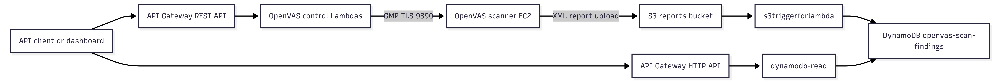
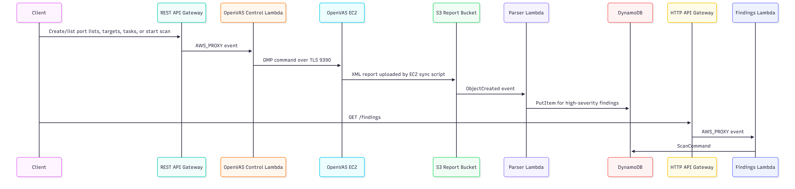

# Lambda Functions

This folder contains the Lambda source files and zip artifacts used by the EVAPA Terraform infrastructure. The Lambdas are the automation layer between API Gateway, the OpenVAS scanner, S3 report uploads, and DynamoDB findings storage.

Terraform uses this folder from:

- `../openvas_lambda.tf`
- `../openvas_api.tf`
- `../lambda_parser.tf`
- `../lambda_api.tf`
- `../apigateway.tf`
- `../iam.tf`
- `../cloudwatch.tf`

## Serverless Architecture



No scheduled Lambda functions are defined in the repository. The OpenVAS report sync schedule is a cron job on the OpenVAS EC2 instance, not a Lambda trigger.

## Function Inventory

| Function name | Terraform resource | Source file | Zip artifact | Runtime | Trigger |
|---|---|---|---|---|---|
| `openvas_create_port_list` | `aws_lambda_function.openvas_api["create_port_list"]` | `create_port_list/create_port_list.py` | `create_port_list/create_port_list.zip` | Python 3.12 | API Gateway REST `POST /port-lists` |
| `openvas_get_port_lists` | `aws_lambda_function.openvas_api["get_port_lists"]` | `get_port_lists/get_port_lists.py` | `get_port_lists/get_port_lists.zip` | Python 3.12 | API Gateway REST `GET /port-lists` |
| `openvas_create_target` | `aws_lambda_function.openvas_api["create_target"]` | `create_target/create_target.py` | `create_target/create_target.zip` | Python 3.12 | API Gateway REST `POST /targets` |
| `openvas_get_targets` | `aws_lambda_function.openvas_api["get_targets"]` | `get_targets/get_targets.py` | `get_targets/get_targets.zip` | Python 3.12 | API Gateway REST `GET /targets` |
| `openvas_create_task` | `aws_lambda_function.openvas_api["create_task"]` | `create_task/create_task.py` | `create_task/create_task.zip` | Python 3.12 | API Gateway REST `POST /tasks` |
| `openvas_get_tasks` | `aws_lambda_function.openvas_api["get_tasks"]` | `get_tasks/get_tasks.py` | `get_tasks/get_tasks.zip` | Python 3.12 | API Gateway REST `GET /tasks` |
| `openvas_start_scan` | `aws_lambda_function.openvas_api["start_scan"]` | `start_scan/start_scan.py` | `start_scan/start_scan.zip` | Python 3.12 | API Gateway REST `POST /tasks/{task_id}/start` |
| `s3triggerforlambda` | `aws_lambda_function.openvas_parser` | `openvas_parser/openvas_lambda.py` | `openvas_parser/openvas_lambda.zip` | Python 3.11 | S3 `ObjectCreated` for `openvas-reports/*.xml` |
| `dynamodb-read` | `aws_lambda_function.dynamodb_read` | `dynamodb_api/index.mjs` | `dynamodb_api/dynamodb_read_payload.zip` | Node.js 20.x | API Gateway HTTP `GET /findings` |

## Shared OpenVAS Lambda Configuration

The seven OpenVAS control functions are created with a single Terraform `for_each` block in `../openvas_lambda.tf`.

| Setting | Value |
|---|---|
| Terraform resource | `aws_lambda_function.openvas_api` |
| Function name pattern | `openvas_${each.key}` |
| Handler pattern | `${each.key}.lambda_handler` |
| Runtime | `python3.12` |
| Timeout | 30 seconds |
| Layer | `aws_lambda_layer_version.gvm_layer` from `../packages/gvm_layer.zip` |
| VPC config | `data.aws_subnets.private.ids` and `aws_security_group.lambda_sg` |
| Execution role | `aws_iam_role.lambda_exec` / `openvas_api_lambda_role` |
| IAM attachment | `AWSLambdaVPCAccessExecutionRole` |
| API invoke permission | `aws_lambda_permission.apigw_invoke_lambdas` and `aws_lambda_permission.apigw_invoke_start_scan` |

Shared environment variables:

| Variable | Set by Terraform | Purpose |
|---|---|---|
| `OPENVAS_IP` | `aws_instance.openvas.private_ip` | Private IP address used for GMP connections. |
| `GMP_USER` | `var.gmp_user` | OpenVAS GMP username. |
| `GMP_PASSWORD` | `var.gmp_password` | OpenVAS GMP password. |

Shared runtime behavior:

1. Read connection settings from environment variables.
2. Open a TLS GMP connection to OpenVAS on TCP `9390`.
3. Authenticate with `GMP_USER` and `GMP_PASSWORD`.
4. Perform one OpenVAS action.
5. Return an API Gateway proxy-style response.

Shared dependencies:

- `python-gvm` from the Lambda layer.
- Standard Python modules such as `json`, `os`, `contextlib`, and `urllib.parse`.
- VPC network access to the OpenVAS scanner security group on TCP `9390`.

Shared log location:

- Expected CloudWatch log group pattern: `/aws/lambda/openvas_<function_key>`.
- `cloudwatch.tf` does not explicitly create log groups for these seven control functions; Lambda creates them on first invocation when the execution role has logging permissions through the VPC access managed policy.

## Workflow Pipelines



## API Route Reference

### POST /port-lists

Creates a new OpenVAS port list.

| Field | Value |
|---|---|
| Lambda | `openvas_create_port_list` |
| Required body | `name`, `port_range` |
| Common errors | `400` when `name` or `port_range` is missing; `500` for GVM or unexpected errors. |

Example request:

```bash
curl -X POST "$API_BASE_URL/port-lists" \
  -H "Content-Type: application/json" \
  -d '{"name":"Full TCP","port_range":"T:1-65535"}'
```

Example response:

```json
{
  "port_list_id": "generated-openvas-id"
}
```

### GET /port-lists

Returns OpenVAS port lists. When query parameter `id` is provided, the function requests a single port list and includes `port_ranges`.

| Field | Value |
|---|---|
| Lambda | `openvas_get_port_lists` |
| Required body | None |
| Optional query string | `id` |
| Common errors | `500` for GVM or unexpected errors. |

Example request:

```bash
curl "$API_BASE_URL/port-lists"
curl "$API_BASE_URL/port-lists?id=<port-list-id>"
```

Example response:

```json
{
  "port_lists": [
    {
      "id": "port-list-id",
      "name": "Full TCP",
      "port_count": "65535"
    }
  ]
}
```

### POST /targets

Creates an OpenVAS scan target by resolving a port list name to its OpenVAS ID.

| Field | Value |
|---|---|
| Lambda | `openvas_create_target` |
| Required body | `name`, `hosts`, `port_list_name` |
| Optional body | `alive_test`, defaults to `Consider Alive` |
| Common errors | `400` for missing fields; `404` when the named port list is not found; `500` for GVM or unexpected errors. |

Example request:

```bash
curl -X POST "$API_BASE_URL/targets" \
  -H "Content-Type: application/json" \
  -d '{"name":"Ubuntu Target","hosts":["10.0.1.25"],"port_list_name":"Full TCP","alive_test":"Consider Alive"}'
```

Example response:

```json
{
  "message": "Target created",
  "target_id": "generated-target-id"
}
```

### GET /targets

Returns OpenVAS targets. When query parameter `id` is provided, the function requests one target and includes host details.

| Field | Value |
|---|---|
| Lambda | `openvas_get_targets` |
| Required body | None |
| Optional query string | `id` |
| Common errors | `500` for GVM or unexpected errors. |

Example request:

```bash
curl "$API_BASE_URL/targets"
curl "$API_BASE_URL/targets?id=<target-id>"
```

Example response:

```json
{
  "targets": [
    {
      "id": "target-id",
      "name": "Ubuntu Target",
      "port_list_name": "Full TCP"
    }
  ]
}
```

### POST /tasks

Creates an OpenVAS task by resolving target, scan config, and scanner names to OpenVAS IDs.

| Field | Value |
|---|---|
| Lambda | `openvas_create_task` |
| Required body | `name`, `target_name` |
| Optional body | `config_name`, defaults to `Full and fast`; `scanner_name`, defaults to `OpenVAS Default` |
| Common errors | `400` for missing `name` or `target_name`; `404` when target/config/scanner name resolution fails; `500` for GVM or unexpected errors. |

Example request:

```bash
curl -X POST "$API_BASE_URL/tasks" \
  -H "Content-Type: application/json" \
  -d '{"name":"Ubuntu Full Scan","target_name":"Ubuntu Target"}'
```

Example response:

```json
{
  "message": "Task created",
  "task_id": "generated-task-id"
}
```

### GET /tasks

Intended to return OpenVAS tasks, with optional detail when query parameter `id` is supplied.

| Field | Value |
|---|---|
| Lambda | `openvas_get_tasks` |
| Required body | None |
| Optional query string | `id` |
| Common errors | Current packaged source references undefined names; see the function notes below. |

Example request:

```bash
curl "$API_BASE_URL/tasks"
curl "$API_BASE_URL/tasks?id=<task-id>"
```

Intended response shape:

```json
{
  "tasks": [
    {
      "id": "task-id",
      "name": "Ubuntu Full Scan",
      "status": "Done",
      "target_name": "Ubuntu Target"
    }
  ]
}
```

### POST /tasks/{task_id}/start

Starts an OpenVAS scan task. The route parameter is named `task_id` in Terraform, but the handler treats that value as a URL-decoded task name and resolves the actual OpenVAS task ID by exact name match.

| Field | Value |
|---|---|
| Lambda | `openvas_start_scan` |
| Required body | None |
| Required path parameter | `task_id`, interpreted by code as the task name |
| Common errors | `400` when the path parameter is missing; `404` when the task name is not found; `500` for GVM or unexpected errors. |

Example request:

```bash
curl -X POST "$API_BASE_URL/tasks/Ubuntu%20Full%20Scan/start"
```

Example response:

```json
{
  "message": "Scan \"Ubuntu Full Scan\" started successfully",
  "report_id": "generated-report-id"
}
```

### GET /findings

Returns parsed findings stored in DynamoDB.

| Field | Value |
|---|---|
| Lambda | `dynamodb-read` |
| API type | API Gateway HTTP API |
| Required body | None |
| Common errors | `500` with `{ "error": "<message>" }` when DynamoDB scan fails. |

Example request:

```bash
curl "$FINDINGS_API_URL/findings"
```

Example response:

```json
[
  {
    "pk": "openvas-reports/report-id.xml",
    "sk": "REPORT_DETAILS",
    "total_high_severity_count": 3,
    "vulnerabilities": []
  }
]
```

## Function Details

### openvas_create_port_list

- Solves: Standardizes creation of OpenVAS port lists through an API instead of manual scanner UI actions.
- Step by step: parses `event.body`; reads `name` and `port_range`; validates both fields; authenticates to OpenVAS; calls `gmp.create_port_list`; returns the new port list ID.
- Trigger type: API Gateway REST API with AWS proxy integration.
- Runtime version: Python 3.12.
- Required environment variables: `OPENVAS_IP`, `GMP_USER`, `GMP_PASSWORD`.
- IAM permissions required: Lambda VPC execution permissions through `AWSLambdaVPCAccessExecutionRole`; API Gateway invoke permission from `aws_lambda_permission.apigw_invoke_lambdas`.
- Request payload format: JSON body with `name` and `port_range`.
- Response format: `200` with `{ "port_list_id": "<id>" }`.
- Error handling behavior: `400` for missing `name` or `port_range`; `500` for `GvmError`; `500` with `details` for unexpected errors.
- Logs location: expected `/aws/lambda/openvas_create_port_list`.
- Dependencies or layers used: `python_gvm_library` Lambda layer from `../packages/gvm_layer.zip`.
- Deployment source / zip: `create_port_list/create_port_list.py`, `create_port_list/create_port_list.zip`.
- Related Terraform names: `aws_lambda_function.openvas_api["create_port_list"]`, `aws_api_gateway_integration.api_integrations["port-lists_POST"]`.

### openvas_get_port_lists

- Solves: Gives API clients a way to list available OpenVAS port lists and inspect one list by ID.
- Step by step: reads optional `queryStringParameters.id`; authenticates to OpenVAS; calls `gmp.get_port_list` when `id` exists or `gmp.get_port_lists` otherwise; maps XML `port_list` elements into JSON.
- Trigger type: API Gateway REST API with AWS proxy integration.
- Runtime version: Python 3.12.
- Required environment variables: `OPENVAS_IP`, `GMP_USER`, `GMP_PASSWORD`.
- IAM permissions required: Lambda VPC execution permissions; API Gateway invoke permission from `aws_lambda_permission.apigw_invoke_lambdas`.
- Request payload format: no body; optional query string `id=<port-list-id>`.
- Response format: `200` with `{ "port_lists": [...] }`; detail mode includes `port_ranges`.
- Error handling behavior: `500` for `GvmError`; `500` with `details` for unexpected errors.
- Logs location: expected `/aws/lambda/openvas_get_port_lists`.
- Dependencies or layers used: `python_gvm_library` Lambda layer.
- Deployment source / zip: `get_port_lists/get_port_lists.py`, `get_port_lists/get_port_lists.zip`.
- Related Terraform names: `aws_lambda_function.openvas_api["get_port_lists"]`, `aws_api_gateway_integration.api_integrations["port-lists_GET"]`.

### openvas_create_target

- Solves: Automates target creation so scan targets can be created from API clients or a dashboard.
- Step by step: parses `event.body`; reads `name`, `hosts`, `port_list_name`, and optional `alive_test`; resolves the port list by name; maps `alive_test` to a python-gvm enum value; calls `gmp.create_target`; returns the new target ID.
- Trigger type: API Gateway REST API with AWS proxy integration.
- Runtime version: Python 3.12.
- Required environment variables: `OPENVAS_IP`, `GMP_USER`, `GMP_PASSWORD`.
- IAM permissions required: Lambda VPC execution permissions; API Gateway invoke permission from `aws_lambda_permission.apigw_invoke_lambdas`.
- Request payload format: JSON body with `name`, `hosts`, `port_list_name`; optional `alive_test`.
- Response format: `200` with `{ "message": "Target created", "target_id": "<id>" }` and CORS headers.
- Error handling behavior: `400` for missing required fields; `404` for missing port list; `500` for `GvmError`; `500` with `details` for unexpected errors.
- Logs location: expected `/aws/lambda/openvas_create_target`.
- Dependencies or layers used: `python_gvm_library` Lambda layer; code includes compatibility handling for `AliveTest` enum import.
- Deployment source / zip: `create_target/create_target.py`, `create_target/create_target.zip`.
- Related Terraform names: `aws_lambda_function.openvas_api["create_target"]`, `aws_api_gateway_integration.api_integrations["targets_POST"]`.

### openvas_get_targets

- Solves: Gives API clients a way to list configured OpenVAS scan targets and inspect one target by ID.
- Step by step: reads optional `queryStringParameters.id`; authenticates to OpenVAS; calls `gmp.get_target` when `id` exists or `gmp.get_targets` otherwise; maps XML `target` elements into JSON.
- Trigger type: API Gateway REST API with AWS proxy integration.
- Runtime version: Python 3.12.
- Required environment variables: `OPENVAS_IP`, `GMP_USER`, `GMP_PASSWORD`.
- IAM permissions required: Lambda VPC execution permissions; API Gateway invoke permission from `aws_lambda_permission.apigw_invoke_lambdas`.
- Request payload format: no body; optional query string `id=<target-id>`.
- Response format: `200` with `{ "targets": [...] }`; detail mode includes `hosts`, `exclude_hosts`, and `max_hosts`.
- Error handling behavior: `500` for `GvmError`; `500` with `details` for unexpected errors.
- Logs location: expected `/aws/lambda/openvas_get_targets`.
- Dependencies or layers used: `python_gvm_library` Lambda layer.
- Deployment source / zip: `get_targets/get_targets.py`, `get_targets/get_targets.zip`.
- Related Terraform names: `aws_lambda_function.openvas_api["get_targets"]`, `aws_api_gateway_integration.api_integrations["targets_GET"]`.

### openvas_create_task

- Solves: Automates OpenVAS task creation without exposing scanner UI workflow to the user.
- Step by step: parses `event.body`; reads `name` and `target_name`; applies default `config_name` of `Full and fast`; applies default `scanner_name` of `OpenVAS Default`; resolves target/config/scanner IDs by exact name; calls `gmp.create_task`; returns the new task ID.
- Trigger type: API Gateway REST API with AWS proxy integration.
- Runtime version: Python 3.12.
- Required environment variables: `OPENVAS_IP`, `GMP_USER`, `GMP_PASSWORD`.
- IAM permissions required: Lambda VPC execution permissions; API Gateway invoke permission from `aws_lambda_permission.apigw_invoke_lambdas`.
- Request payload format: JSON body with `name`, `target_name`; optional `config_name`, `scanner_name`.
- Response format: `200` with `{ "message": "Task created", "task_id": "<id>" }` and CORS headers.
- Error handling behavior: `400` for missing `name` or `target_name`; `404` for missing target/config/scanner name; `500` for `GvmError`; `500` with `details` for unexpected errors.
- Logs location: expected `/aws/lambda/openvas_create_task`.
- Dependencies or layers used: `python_gvm_library` Lambda layer.
- Deployment source / zip: `create_task/create_task.py`, `create_task/create_task.zip`.
- Related Terraform names: `aws_lambda_function.openvas_api["create_task"]`, `aws_api_gateway_integration.api_integrations["tasks_POST"]`.

### openvas_get_tasks

- Solves: Intended to list OpenVAS scan tasks and expose progress details for one task by ID.
- Step by step: reads optional `queryStringParameters.id`; is intended to authenticate to OpenVAS; calls `gmp.get_task` when `id` exists or `gmp.get_tasks` otherwise; maps XML `task` elements into JSON; normalizes progress values for statuses such as `Done`, `New`, `Requested`, and `Queued`.
- Trigger type: API Gateway REST API with AWS proxy integration.
- Runtime version: Python 3.12.
- Required environment variables: intended to use `OPENVAS_IP`, `GMP_USER`, `GMP_PASSWORD`.
- IAM permissions required: Lambda VPC execution permissions; API Gateway invoke permission from `aws_lambda_permission.apigw_invoke_lambdas`.
- Request payload format: no body; optional query string `id=<task-id>`.
- Response format: intended `200` with `{ "tasks": [...] }`; detail mode includes `progress`, `report_count`, and `scanner_name`.
- Error handling behavior: intended `500` for `GvmError` and unexpected errors.
- Logs location: expected `/aws/lambda/openvas_get_tasks`.
- Dependencies or layers used: intended to use the `python_gvm_library` Lambda layer.
- Deployment source / zip: `get_tasks/get_tasks.py`, `get_tasks/get_tasks.zip`.
- Related Terraform names: `aws_lambda_function.openvas_api["get_tasks"]`, `aws_api_gateway_integration.api_integrations["tasks_GET"]`.
- Implementation note: the checked-in source file and the zip artifact both start at `lambda_handler` and reference `get_gmp_connection`, `json`, and `GvmError` without defining or importing them. As packaged in this repository, this Lambda needs the shared imports/helper restored and the zip rebuilt before it can run successfully.

### openvas_start_scan

- Solves: Starts an OpenVAS task from an API route so scans can be launched programmatically.
- Step by step: reads `event.pathParameters.task_id`; URL-decodes it; treats the value as a task name; authenticates to OpenVAS; finds the matching task ID by exact task name; calls `gmp.start_task`; extracts `report_id` when available; returns scan-start confirmation.
- Trigger type: API Gateway REST API with AWS proxy integration.
- Runtime version: Python 3.12.
- Required environment variables: `OPENVAS_IP`, `GMP_USER`, `GMP_PASSWORD`.
- IAM permissions required: Lambda VPC execution permissions; API Gateway invoke permission from `aws_lambda_permission.apigw_invoke_start_scan`.
- Request payload format: no body; path parameter `task_id`, interpreted by code as task name.
- Response format: `200` with `{ "message": "Scan \"<task_name>\" started successfully", "report_id": "<id-or-null>" }` and CORS headers.
- Error handling behavior: `400` when the path parameter is missing; `404` when no task name matches; `500` for `GvmError`; `500` with `details` for unexpected errors.
- Logs location: expected `/aws/lambda/openvas_start_scan`.
- Dependencies or layers used: `python_gvm_library` Lambda layer.
- Deployment source / zip: `start_scan/start_scan.py`, `start_scan/start_scan.zip`.
- Related Terraform names: `aws_lambda_function.openvas_api["start_scan"]`, `aws_api_gateway_integration.start_scan_integration`, `aws_api_gateway_resource.task_id`, `aws_api_gateway_resource.start_scan`.

### s3triggerforlambda

- Solves: Converts OpenVAS XML reports in S3 into DynamoDB records that can be queried by API clients.
- Step by step: iterates over `event["Records"]`; extracts S3 bucket and key; reads the XML object; parses XML with `xml.etree.ElementTree`; scans `.//results/result`; keeps findings where numeric `severity` is greater than `7.0`; stores one DynamoDB item for the report when high-severity findings exist.
- Trigger type: S3 `ObjectCreated:*` notification on the OpenVAS reports bucket.
- Runtime version: Python 3.11.
- Required environment variables: `DYNAMODB_TABLE_NAME`, set by Terraform to `aws_dynamodb_table.openvas_scan_findings.name`; code defaults to `openvas-scan-findings` if missing.
- IAM permissions required: `s3:GetObject` on `${project_name}-openvas-reports/*`; `dynamodb:PutItem`, `dynamodb:BatchWriteItem`, and `dynamodb:DescribeTable` on `openvas-scan-findings`; CloudWatch basic logging through `AWSLambdaBasicExecutionRole`; S3 invoke permission through `aws_lambda_permission.allow_s3`.
- Request payload format: S3 event with `Records[].s3.bucket.name` and `Records[].s3.object.key`.
- Response format: `200` with JSON string `"XML processing and DynamoDB upload complete."`.
- Error handling behavior: logs processing errors and re-raises the exception so the Lambda invocation fails; skips non-numeric severity values; does not write to DynamoDB when no severity values greater than `7.0` are found.
- Logs location: `/aws/lambda/s3triggerforlambda`; explicitly created in `../cloudwatch.tf` with 7-day retention.
- Dependencies or layers used: `boto3`, standard Python XML/date/decimal libraries; no custom Lambda layer in Terraform.
- Deployment source / zip: `openvas_parser/openvas_lambda.py`, `openvas_parser/openvas_lambda.zip`.
- Related Terraform names: `aws_lambda_function.openvas_parser`, `aws_s3_bucket_notification.openvas_trigger`, `aws_lambda_permission.allow_s3`, `aws_iam_role_policy.lambda_policy`.

DynamoDB item shape written by the parser:

```json
{
  "pk": "openvas-reports/report-id.xml",
  "sk": "REPORT_DETAILS",
  "processed_timestamp": "2026-04-16T00:00:00.000000",
  "total_high_severity_count": 1,
  "vulnerabilities": [
    {
      "vulnerability_name": "Example finding",
      "host": "10.0.1.25",
      "port": "80/tcp",
      "threat_level": "High",
      "cvss_severity": 8.5,
      "nvt_oid": "example-oid"
    }
  ]
}
```

### dynamodb-read

- Solves: Exposes parsed vulnerability findings to API clients without requiring direct DynamoDB access.
- Step by step: creates a DynamoDB client; sends a `ScanCommand` against table `openvas-scan-findings`; returns `data.Items` as JSON.
- Trigger type: API Gateway HTTP API with AWS proxy integration.
- Runtime version: Node.js 20.x.
- Required environment variables: none; table name is hardcoded in `index.mjs` as `openvas-scan-findings`.
- IAM permissions required: `dynamodb:Scan`, `dynamodb:Query`, and `dynamodb:GetItem` from `aws_iam_role_policy.lambda_dynamodb_read`; CloudWatch basic logging through `AWSLambdaBasicExecutionRole`; API Gateway invoke permission through `aws_lambda_permission.api_invoke`.
- Request payload format: no required body or query string.
- Response format: `200` with JSON array of DynamoDB items and CORS/content-type headers.
- Error handling behavior: returns `500` with `{ "error": err.message }` when DynamoDB access fails.
- Logs location: `/aws/lambda/dynamodb-read`; explicitly created in `../cloudwatch.tf` with 7-day retention.
- Dependencies or layers used: imports `@aws-sdk/client-dynamodb` and `@aws-sdk/lib-dynamodb`; no custom layer is attached.
- Deployment source / zip: `dynamodb_api/index.mjs`; Terraform packages `dynamodb_api/dynamodb_read_payload.zip` with `data.archive_file.lambda_zip`.
- Related Terraform names: `aws_lambda_function.dynamodb_read`, `data.archive_file.lambda_zip`, `aws_apigatewayv2_route.get_findings`, `aws_apigatewayv2_integration.lambda_integration`, `aws_iam_role_policy.lambda_dynamodb_read`.

## IAM And Security Notes

| Area | Current implementation |
|---|---|
| OpenVAS control Lambdas | Use `openvas_api_lambda_role` with `AWSLambdaVPCAccessExecutionRole`; no AWS API permissions are needed for GMP because scanner control is a network call to the OpenVAS EC2 host. |
| Parser and findings Lambdas | Share `openvas-lambda-role`, which has S3 read, DynamoDB write/read policies, and basic CloudWatch logging. |
| API authorization | REST API methods in `openvas_api.tf` use `authorization = "NONE"`; HTTP API has no authorizer in `apigateway.tf`. |
| OpenVAS credentials | `GMP_USER` and `GMP_PASSWORD` are Lambda environment variables sourced from Terraform variables. |
| Network path | OpenVAS control Lambdas are attached to VPC subnets and security group `aws_security_group.lambda_sg`; egress is limited to TCP `9390` within the selected VPC CIDR. |
| S3 trigger scope | Parser triggers only for keys with prefix `openvas-reports/` and suffix `.xml`. |

## Monitoring And Observability

| Function group | Log group behavior |
|---|---|
| OpenVAS control Lambdas | Expected CloudWatch log group per Lambda, for example `/aws/lambda/openvas_create_target`. Not explicitly declared in `cloudwatch.tf`. |
| Parser Lambda | `/aws/lambda/s3triggerforlambda`, explicitly declared with 7-day retention. |
| Findings Lambda | `/aws/lambda/dynamodb-read`, explicitly declared with 7-day retention. |

Useful commands:

```bash
aws logs tail /aws/lambda/s3triggerforlambda --follow --region us-east-1
aws logs tail /aws/lambda/dynamodb-read --follow --region us-east-1
aws lambda list-functions --region us-east-1
```

## Packaging Notes

The OpenVAS control and parser functions are deployed from checked-in zip artifacts. If a Python source file changes, rebuild its corresponding zip before applying Terraform.

Example:

```bash
cd terraform-infra/lambda/create_target
zip create_target.zip create_target.py
```

The findings read function is packaged by Terraform:

```hcl
data "archive_file" "lambda_zip" {
  source_dir  = "${path.module}/lambda/dynamodb_api/"
  output_path = "${path.module}/lambda/dynamodb_api/dynamodb_read_payload.zip"
}
```

The current `dynamodb_read_payload.zip` artifact contains `index.mjs` and a nested `dynamodb_read_payload.zip` entry. Terraform can regenerate the artifact from `dynamodb_api/` during plan/apply.

## Common Troubleshooting

| Symptom | Likely cause | Where to check |
|---|---|---|
| OpenVAS API returns timeout or connection errors | OpenVAS containers or GMP proxy are not ready, or Lambda cannot reach TCP `9390`. | OpenVAS EC2 logs, security groups, `/aws/lambda/openvas_*`. |
| `GET /tasks` fails immediately | `get_tasks` package references undefined helper/imports. | `get_tasks/get_tasks.py` and `get_tasks/get_tasks.zip`. |
| Parser does not run | S3 object key is outside `openvas-reports/` or does not end in `.xml`. | S3 object key, `aws_s3_bucket_notification.openvas_trigger`. |
| DynamoDB has no findings | XML report had no severity values greater than `7.0`, or parser failed. | `/aws/lambda/s3triggerforlambda`, DynamoDB table scan. |
| Findings API returns 500 | DynamoDB scan failed or IAM policy is missing. | `/aws/lambda/dynamodb-read`, `aws_iam_role_policy.lambda_dynamodb_read`. |

## Related Terraform Files

- `../openvas_lambda.tf`
- `../openvas_api.tf`
- `../lambda_parser.tf`
- `../lambda_api.tf`
- `../apigateway.tf`
- `../iam.tf`
- `../cloudwatch.tf`
